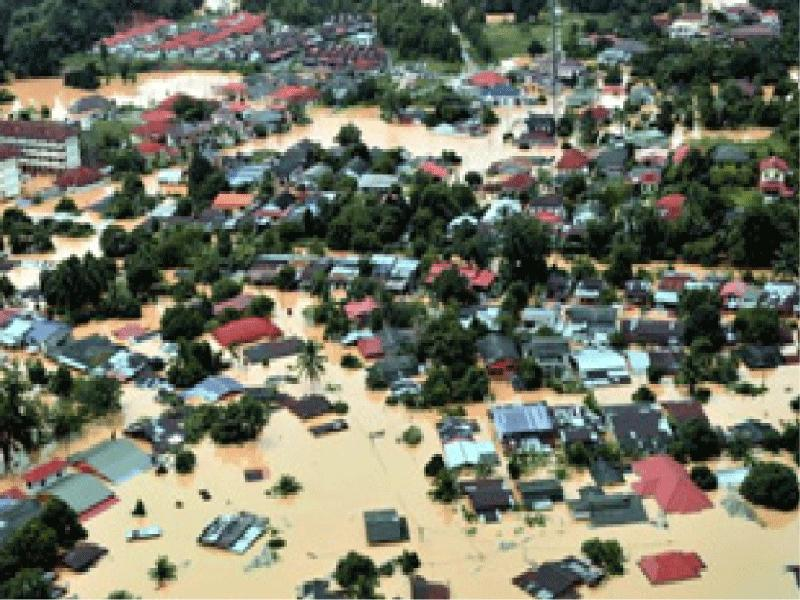
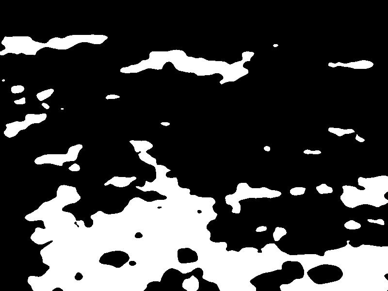
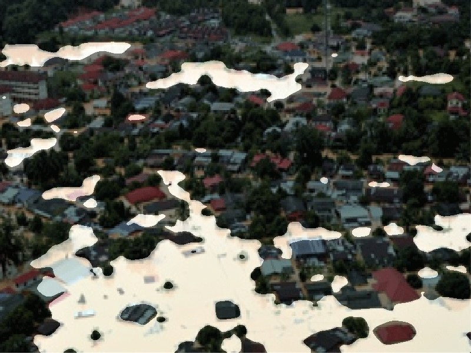

# U-Net: Semantic segmentation with PyTorch - Custom dataset

**Offline Dataset preprocessing**

Make sure the data you have satisfies following conditions

- Directory tree
```
   - Data
          -- imgs
                  -- all train images
          -- masks 
                  -- all masks (file names should be same as train images)
```
- Size and color space
    - Make sure you have same size images
    - Make sure you have RGB color space for all images
    - if you need you can use ```utils\\resize_and_img_format.py`` file
- Mask values (I have tested only for these values it might also work for multi labels but you need to adjust the classes)
    - Make sure mask values are only two i.e either 0 or 255
    - if you need you can use ```utils\\convert_to_binary.py``` file

**Flood Area dataset**

I have used all the offline dataset preprocessing for this [kaggle dataset](https://www.kaggle.com/datasets/faizalkarim/flood-area-segmentation) 

- data.zip holds the preprocessed images
- ```unzip data.zip```

**Installation**

- ```pip install -r requirements```

**Training**

- ```python train.py --epochs 100 --batch-size 16```

**Prediction**


- Visuvalize - ```python predict.py --model ./checkpoints/checkpoint_epoch100.pth -i ./data/imgs/0.jpg --viz --output ./0_OUT.jpg```

- You can use utils/blending.py to create blended image

Image and mask




Blended Segmentation : 




**Colab NoteBook**

- [Link](https://colab.research.google.com/drive/1aM2VOqfhwo84zSe-MS_i2JyWO8bgouqD?usp=sharing)

**Credits**

- [Pytorch-Unet](https://github.com/milesial/Pytorch-UNet)